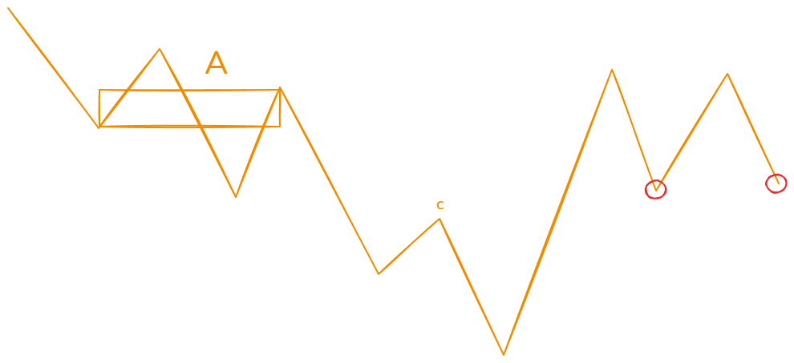

## CLXS0004

这个三买的形态选股，当然这并不是严格意义上的三买。三买形态选股只是给他一个统称，这个形态下面有五种变体。列出图形如下：

当红圈的地方出信号的时候（就是之前说的六种信号，以后不再赘述，说到出信号就是这6中信号）

信号点的最低价格高于A中枢的中枢高，其中A中枢是下跌过程中的最后一个笔中枢，黄色线表示的是笔。

变种：当红色圈处出信号的时候，最低价大于c处的最高价。

变种：当红色圈处出信号的时候，最低价大于c处的最高价。

以上我们说的是下跌过程中，针对下跌中枢的反转三买。

接下来说的是上涨过程中，针对第一个上涨中枢的三买。

当红圈的地方出信号的时候，信号点的最低价格高于A中枢的中枢高，其中A中枢是上涨过程中的第一个笔中枢，黄色线表示的是笔。

变种：c点是上涨中的第一个高点，后续的回踩笔两个红圈地方出信号的时候，最低价格笔c处的最高价格高。
