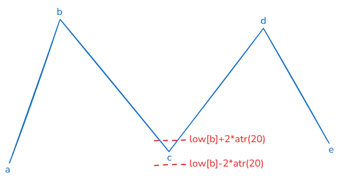

## CLXS0006

CLXS0006其实比较简单，如果非要找一个理论依据，可以溯源到维科夫的spring方法，即弹簧理论。当股价跌回到前低的时候，出现的反弹现象。这里的前低我们取前一个线段的低点，如上c点是线段前低，我们取c点最低价的2个atr的波动区间，当e跌回到这个区间后出现的反弹我们做提示信号。

上面是简单的例子，实际我们还取c点的前一个线段低点a点的2个atr的波动区间范围作为参考区间。