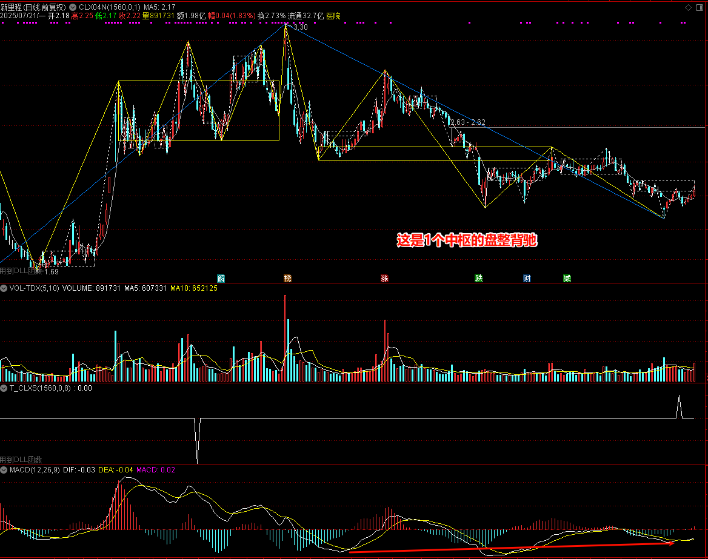
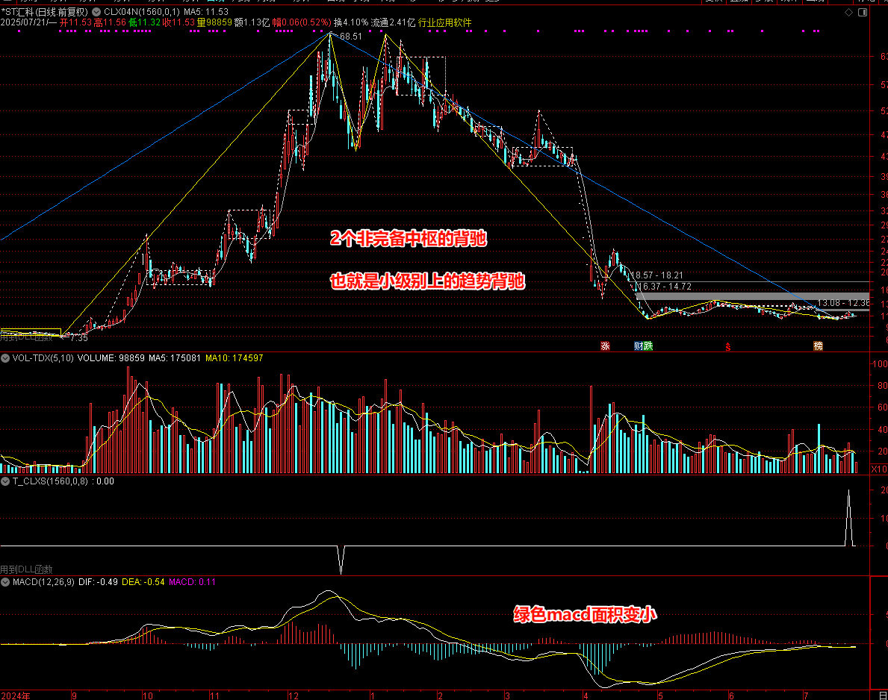
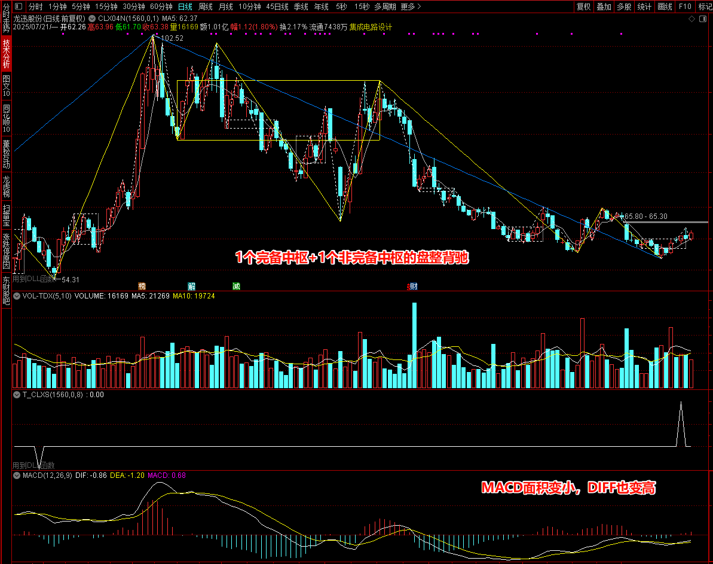

## CLX0008

此模型是盘整背驰或趋势背驰的选股，在大的级别上，这个模型作为选股模型使用，在小的级别上，这个模型也可以作为交易信号模型使用。

所谓背驰，我们就是对比进入中枢的一笔和离开中枢一笔的DIFF值或者MACD累积值。

买点的判断：离开中枢的一笔的DIFF值大于进入中枢的一笔的DIFF值，或者离开中枢的一笔的绿色MACD累积值大于进入中枢的一笔的绿色MACD累积值。

卖点的判断：离开中枢的一笔的DIFF值小于进入中枢的一笔的DIFF值，或者离开中枢的一笔的红色MACD累积值小于进入中枢的一笔的红色MACD累积值。

在MACD发生金叉或者死叉的时候我们做这个判断。

用图来直观地表示，就如下图所示：

买点的输出信号值是：101, 201, 301等，分别代表1个中枢的背驰，2个中枢的背驰，3个中枢的背驰，以此类推。

卖点的输出信号值是：-101, -201, -301等，分别代表1个中枢的背驰，2个中枢的背驰，3个中枢的背驰，一次类推。

另外这里中枢会略微放宽些，除了要求第一个中枢背驰的时候，中枢要求是完备中枢，两个及两个以上中枢的背驰，我们不要求必须是完备中枢。

什么是非完备中枢？

比如下上下三段中，我把中间的上称为是非完备中枢。

下面我在用几个图来展示一下他们的形态。

