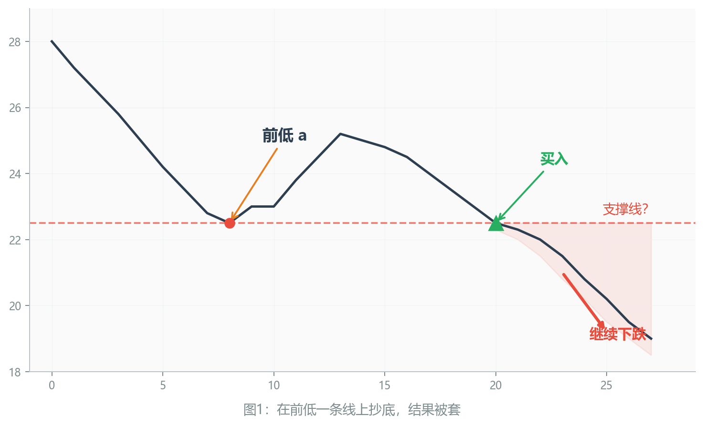
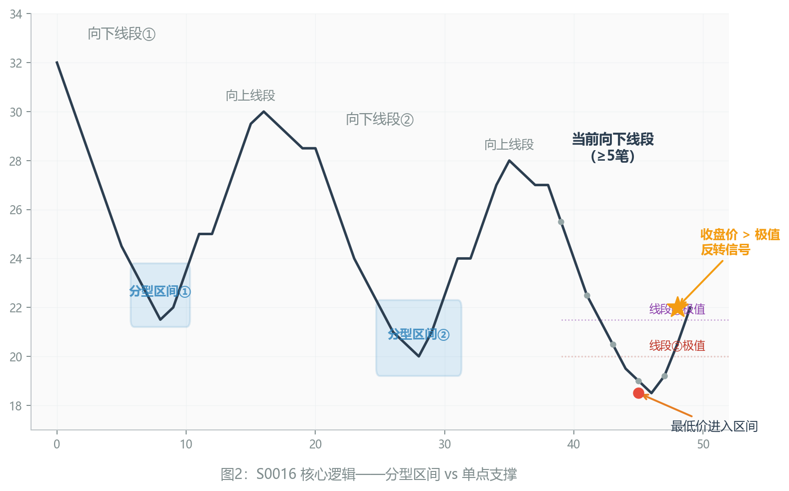
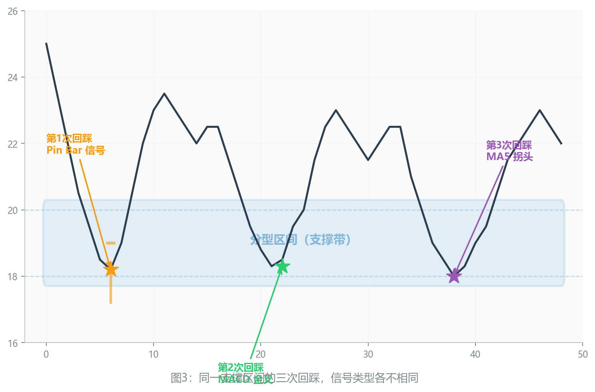

# FqCopilot 新模型 S0016：你画的支撑是一条线，市场看到的是一个区间

今天，FqCopilot 上线了第 17 号选股模型——**S0016 支撑/阻力区间反转策略**。

这个模型解决的是一个老问题：**支撑位抄底，为什么总是差那么一点？**

---

## 一、一条线的幻觉

先看一张图。

<!-- 图1：线段下跌，前低a处画一条水平线，股价跌回后继续破位 -->

一个向下线段走完，前低 a 点清晰可见。股价再次下跌回到 a 点附近，你觉得这就是支撑，买入。

然后股价继续往下走了。

这个场景太常见了。问题出在哪？

**支撑从来不是一个价格，是一个区域。**

a 点那个位置，市场经历过一次多空博弈——向下线段在那里形成了一个底分型，买方和卖方在那个价格区间反复争夺。分型有高有低，这个从低到高的范围，才是真正的支撑带。

你在分型的最低价画一条线，觉得"到这个价格就会反弹"，但市场根本不认这条线。市场认的是那个博弈区间。

---

## 二、S0016 的逻辑

S0016 做的事情很简单：**自动识别分型区间，等股价回到区间时给出反转信号。**

具体条件：

1. 当前是一个向下线段，且包含至少 5 笔——说明跌势已经充分展开
2. 这个线段的最低价，进入了前两个向下线段的分型区间——历史支撑带被触及
3. 收盘价高于前序线段的低点——说明空头没有完全掌控
4. 出现反转确认信号（pinbar、MACD 金叉、MA5 拐头等）——不是到了就买，是等市场确认

<!-- 图2：两个向下线段的分型区间叠加，当前线段进入区间后出信号 -->

注意第 2 条：**前两个**向下线段。不只是看最近一个前低，而是同时参考更早的一个。如果两个分型区间有重叠，说明那个区域经受了更多次的测试，支撑力度更强。

---

## 三、不是一次机会，是三次

支撑区间有一个特点：它不会只被测试一次。

S0016 对同一个区间最多追踪三次回踩：

- **第 1 次回踩**——区间刚刚被触及，支撑效力最强
- **第 2 次回踩**——区间经受住了第一次考验，再次被验证
- **第 3 次回踩**——事不过三，这次如果还能撑住，信号依然有效；但如果破了，也不用遗憾

<!-- 图3：同一个支撑区间被三次回踩，每次出不同类型的信号 -->

三次回踩的信号类型也可能不同。第 1 次可能是 pinbar（长下影线），第 2 次可能是 MACD 金叉，第 3 次可能是 MA5 拐头。这说明市场在用不同的方式告诉你同一件事：**这里有人在守。**

---

## 四、卖点：镜像对称

上面讲的都是买点。卖点的逻辑完全对称：

- 当前向上线段（≥5 笔）的最高价进入前两个向上线段的阻力区间
- 收盘价低于前序线段高点
- 出现反转确认信号

不再展开，懂了买点就懂了卖点。

---

## 五、和其他模型的区别

FqCopilot 已经有 16 个模型了，为什么还要加 S0016？

最接近的是 S0006（ATR 回踩支撑）和 S0007（顶底互换）。区别在于：

| | S0006 | S0007 | **S0016** |
|---|---|---|---|
| 支撑定义 | 前低 ± 2倍ATR | 笔的顶点 | **分型区间** |
| 参考范围 | 1 个前低 | 1 个笔顶点 | **前 2 个同方向线段** |
| 信号次数 | 1 次 | 1 次 | **最多 3 次** |
| 最少笔数 | 无要求 | 无要求 | **≥5 笔** |

S0016 的条件更严格：要求线段至少 5 笔（排除短促的假线段），同时参考两个历史区间（不是孤证），分型区间本身也比 ATR 偏移更有市场结构含义。

---

## 六、写在最后

当股价回到一个曾经发生过激烈博弈的区域，你需要的不只是勇气，还需要一个确认信号。

S0016 做的就是这件事：找到那些市场曾经激烈争夺过的价格区域，等价格回到那里，等市场自己告诉你它准备反转。

不是预测，是确认。

---

> FqCopilot S0016 模型已上线，使用 `fqctl stock screen clxs --model-opt 16` 即可体验。
