# FQCOPILOT模型集锦

## CLXS0001

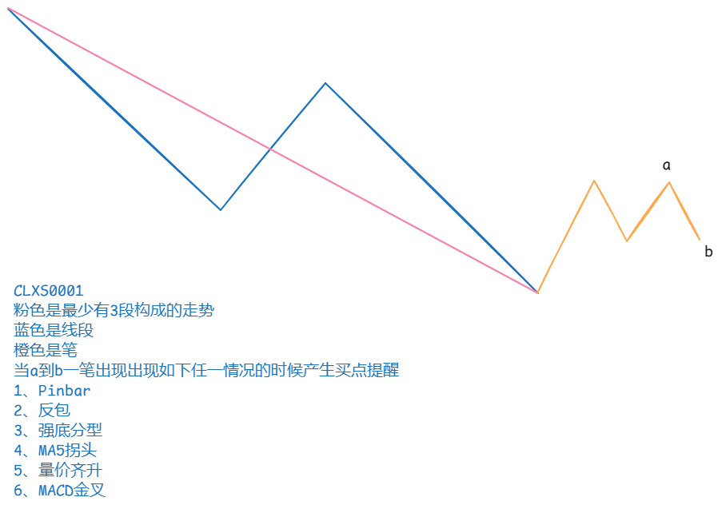

1、2、3、4、6还是比较好理解。

说明一下什么是量价齐升：

底分型的最低K线是阳线，他的右边K线是阳线，右边K线的实体大小是左边K线实体大小的2倍，右边K线的成交量是左边K线成交量的2倍。那么右边这个K线就是量价齐升，我们作为信号提醒出来。

用了2天时间也只是完成了1-5的实现，目前6还没实现，留待以后更新。

另外每个信号还需要能单独出提醒，这个也是留待以后更新。

参数说明：

| 参数         | 默认值   | 说明                                                                           |
| ---------- | ----- | ---------------------------------------------------------------------------- |
| WAVEOPT    | 1560  | 笔控制参数                                                                        |
| STRETCHOPT | 0     | 线段控制参数，现在没有启用                                                                |
| TRENDOPT   | 0     | 走势控制参数，现在没有启用                                                                |
| MODELOPT   | 10001 | 模型参数，低位的四个数字表示是哪个模型，0001就是CLXS0001模型。高位的是控制参数，1表示要套粉色的走势，0就不需要套粉色的走势（条件更宽松）。 |

在python端的函数签名也做了改动，示例如下：

```
highs = stock_day_data.high.to_list()
lows = stock_day_data.low.to_list()
opens = stock_day_data.open.to_list()
closes = stock_day_data.close.to_list()
volumes = stock_day_data.volume.to_list()
length = len(highs)
model_opt = 10001
sigs: list<float> = fq_clxs(
    length, highs, lows, opens, closes, volumes, 
    wave_opt, stretch_opt, trend_opt, model_opt)
```

返回的sigs的元素值是0-6，和上面图中的信号序号是一致的。

## CLXS0002

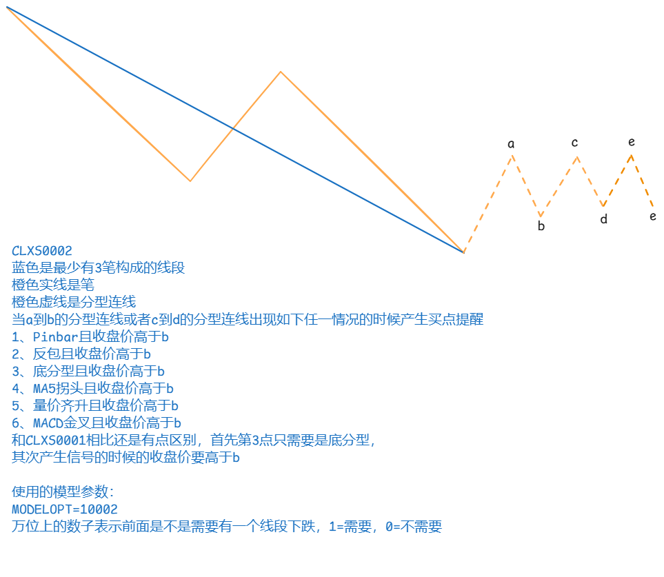

这是CLXS0001的衍生版本，是在笔段的构建上和CLXS0001有些区别。

当MODELOPT=10002或者0002的时候使用CLXS0002进行选股。

## CLXS0003


当MODELOPT=0003的时候，使用CLXS0003进行选股。如上图说说明的，在G点和I点满足条件的时候出信号。

## CLXS0004

这个三买的形态选股，当然这并不是严格意义上的三买。三买形态选股只是给他一个统称，这个形态下面有五种变体。列出图形如下：

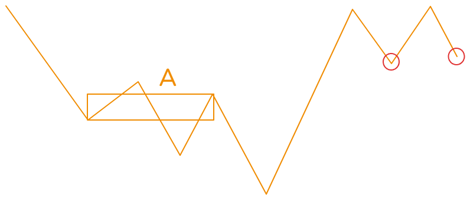
当红圈的地方出信号的时候（就是之前说的六种信号，以后不再赘述，说到出信号就是这6中信号）

信号点的最低价格高于A中枢的中枢高，其中A中枢是下跌过程中的最后一个笔中枢，黄色线表示的是笔。


变种：当红色圈处出信号的时候，最低价大于c处的最高价。

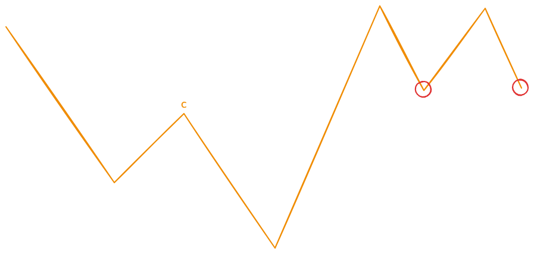
变种：当红色圈处出信号的时候，最低价大于c处的最高价。

以上我们说的是下跌过程中，针对下跌中枢的反转三买。

接下来说的是上涨过程中，针对第一个上涨中枢的三买。

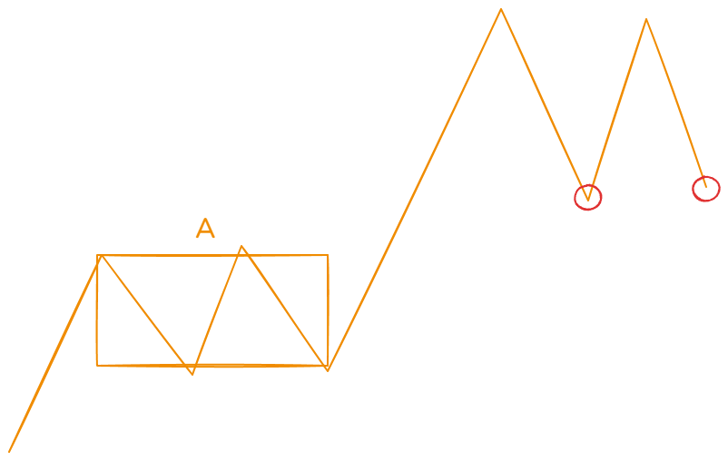
当红圈的地方出信号的时候，信号点的最低价格高于A中枢的中枢高，其中A中枢是上涨过程中的第一个笔中枢，黄色线表示的是笔。

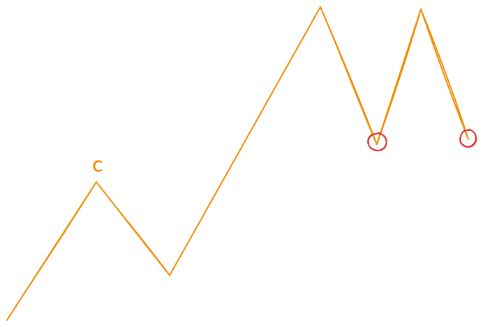

变种：c点是上涨中的第一个高点，后续的回踩笔两个红圈地方出信号的时候，最低价格笔c处的最高价格高。

## CLXS0005

此模型是一个二买模型，第一次预警是在c点，这是一个二买提醒点，第二次预警是在e点，这是一个类二买提醒点。

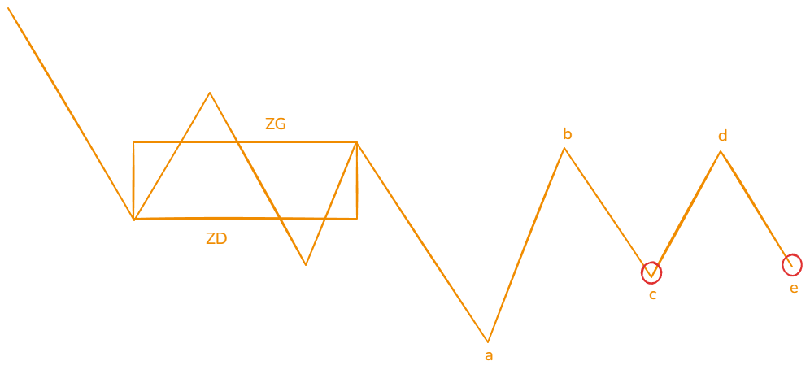

当MODELOPT==00005的时候，b点和d的要求只要比ZD高，不要求比ZG高，如上图。

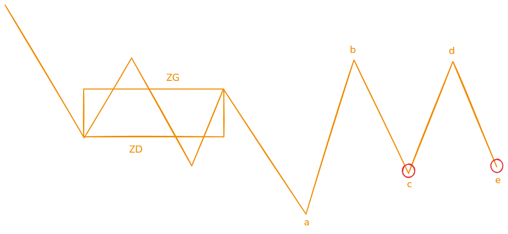

当MODELOPT==10005的时候，b点和d的要求比ZG高，如上图。

另外你还可以控制只需要c点或者e点，或者两者都要。看下选股代码中的最后2句：

```
RESET:=TDXDLL7(1,0,0,0);
IG1:=TDXDLL7(2, 6, WAVEOPT, 0);
IG2:=TDXDLL7(2, 7, STRETCHOPT, 0);
IG3:=TDXDLL7(2, 8, TRENDOPT, 0);
IG4:=TDXDLL7(2, 9, MODELOPT, 0);
IG5:=TDXDLL7(2, 3, OPEN, 0);
IG6:=TDXDLL7(2, 5, VOL, 0);
SIG:=TDXDLL7(3,HIGH,LOW,CLOSE);
BUY_OPEN:SIG>0;
```

当SIG>0的时候，c点和e点两个都要。

当SIG>100 AND SIG<200的时候，只要c点。

当SIG>200的时候，只要e点。

## CLXS0006


CLXS0006其实比较简单，如果非要找一个理论依据，可以溯源到维科夫的spring方法，即弹簧理论。当股价跌回到前低的时候，出现的反弹现象。这里的前低我们取前一个线段的低点，如上c点是线段前低，我们取c点最低价的2个atr的波动区间，当e跌回到这个区间后出现的反弹我们做提示信号。

上面是简单的例子，实际我们还取c点的前一个线段低点a点的2个atr的波动区间范围作为参考区间。

## CLXS0007

对于技术流玩家来讲，什么是顶底互换应该再熟悉不过。CLX0007就是借鉴顶底互换的思路建立的模型。

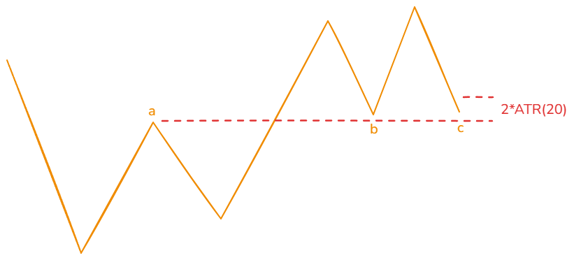

我们采用笔的顶点作为低点和高点的的参数，如上图，a是任意的一笔的高点，其后如果出现和b点或者c点，他们都高于a点（由a点得到支撑），b点或c点进入到离a点2倍的ATR(20)的范围出现了反转信号，我们做买入信号提醒，b和c两处都会做提醒。

## CLX0008

盘整或趋势背驰选股，这里的背驰公式是这样的，对比进入中枢的一笔和离开中枢的一笔，当发生dif金叉dea的时候，如果离开中枢的dif值要大于进入中枢的dif值，认为是背驰做提醒。


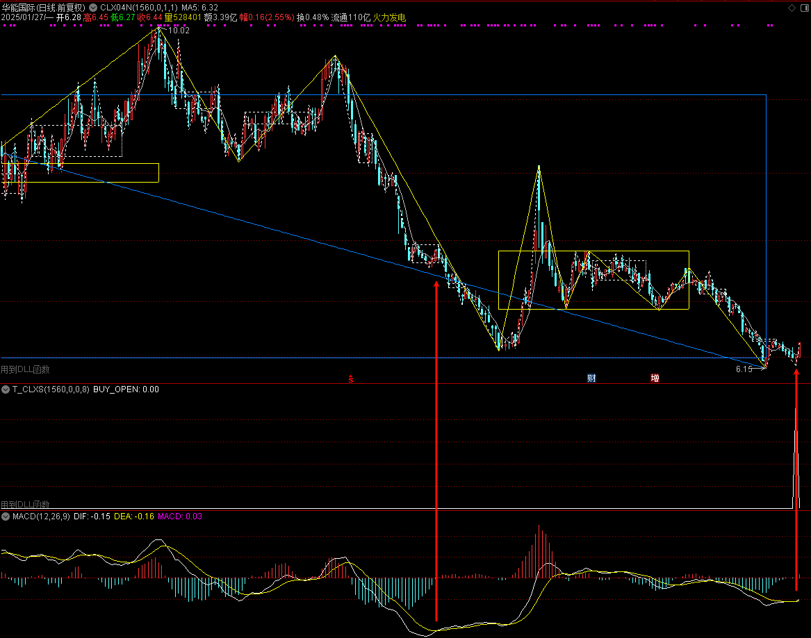

## CLX0009

这个模型来源是番茄量化python系统中的一个模型，把模型移植到fqcopilot中，但模型条件不完全一致，应该算原来模型的改良演化，是改好了还是改坏了还不好说，移植后先使用观察，再继续迭代。

模型的判断过程如下：

1. 在下跌的一个线段中，最后一个中枢是完备的笔中枢。

2. 离开中枢的一笔跌破笔中枢的最低价。

3. 跌破之后，有K线的收盘价又涨会了笔中枢最低价的上方。

4. 然后，出现下跌一笔的反转信号。

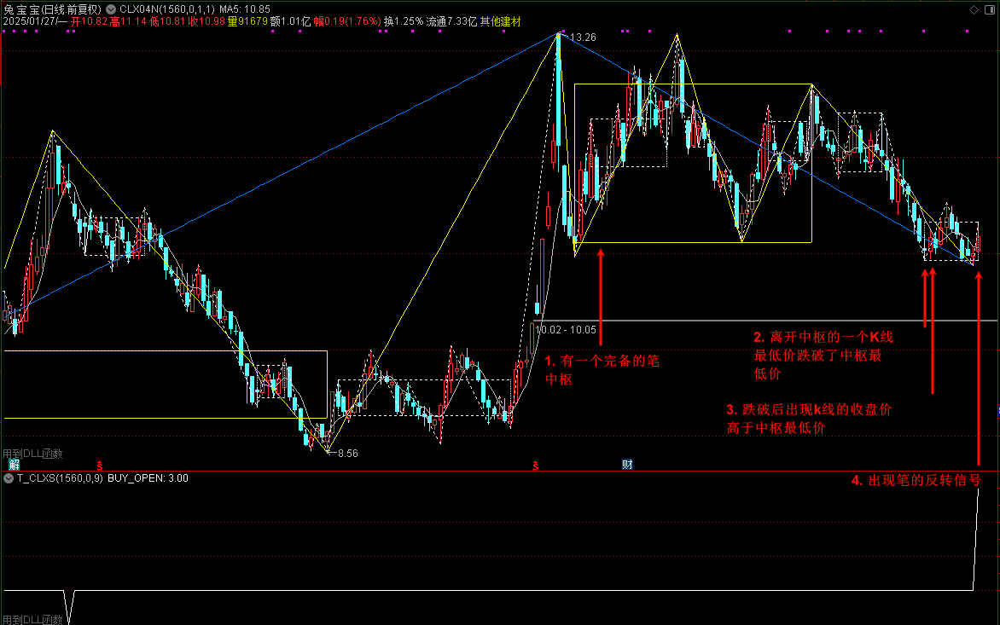

这里的第一种情况，收盘价回到中枢最低点上方但是没有继续延申向上一笔。

还有第二种情况，当收盘价回到中枢的最低点上面的时候，要不要等延申出向上一笔，然后再等向下一笔的反转（如下图所示）。大家也可以讨论下意见。

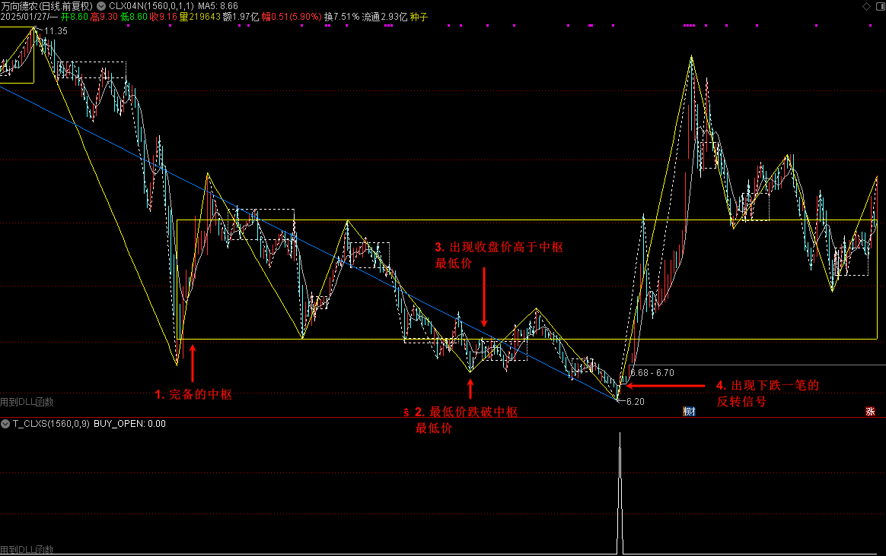

这个模型还有另外一种情况：

当跌破中枢最低点后，有K线的收盘价又涨回了中枢低的上方。再后面的回踩一笔出现反转信号的时候作为另一个信号点提醒。

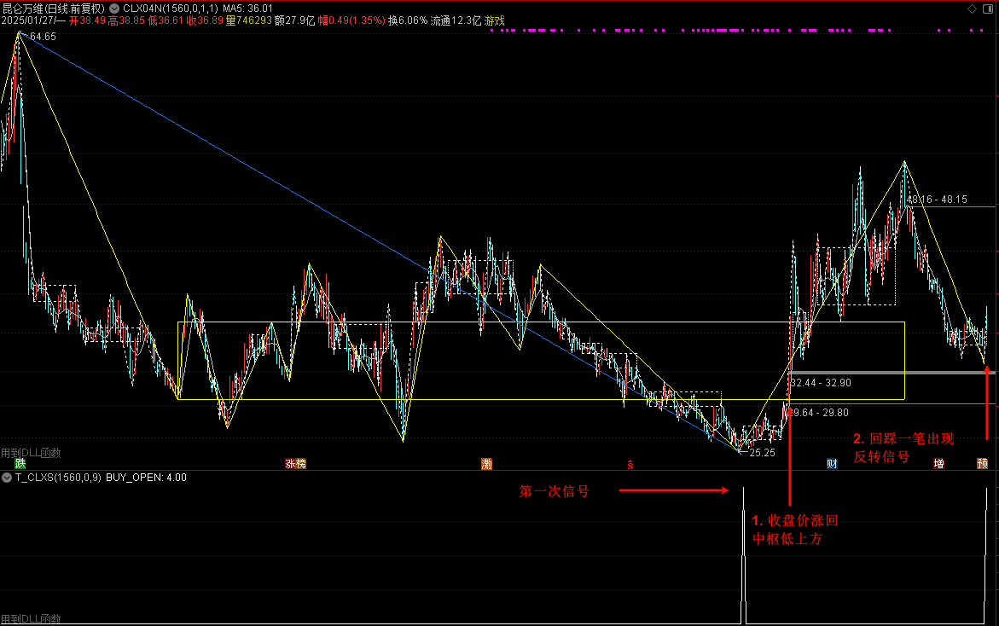
