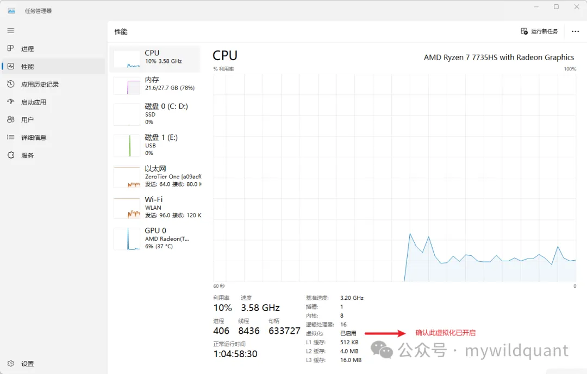
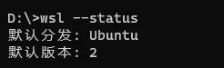
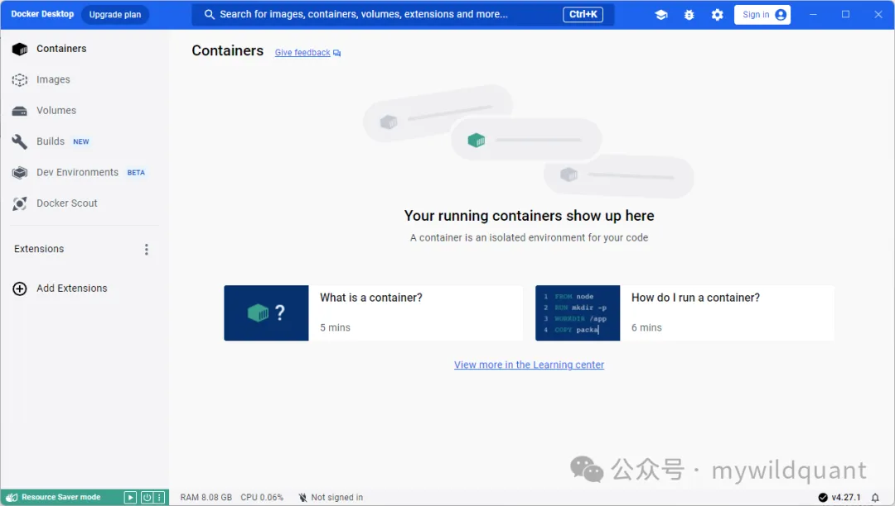
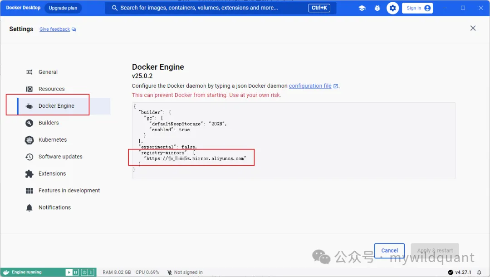
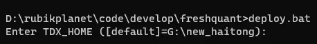
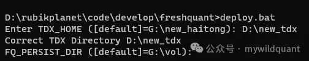
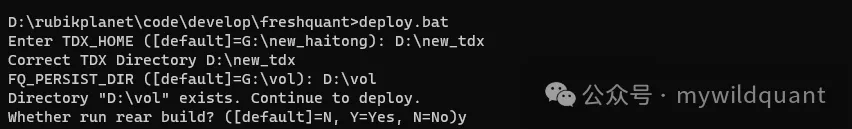
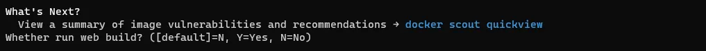
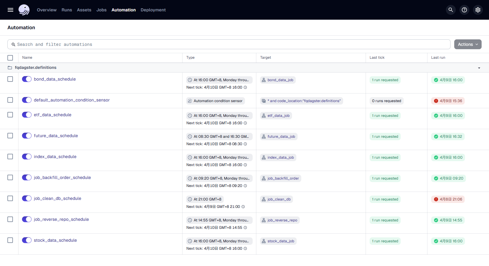
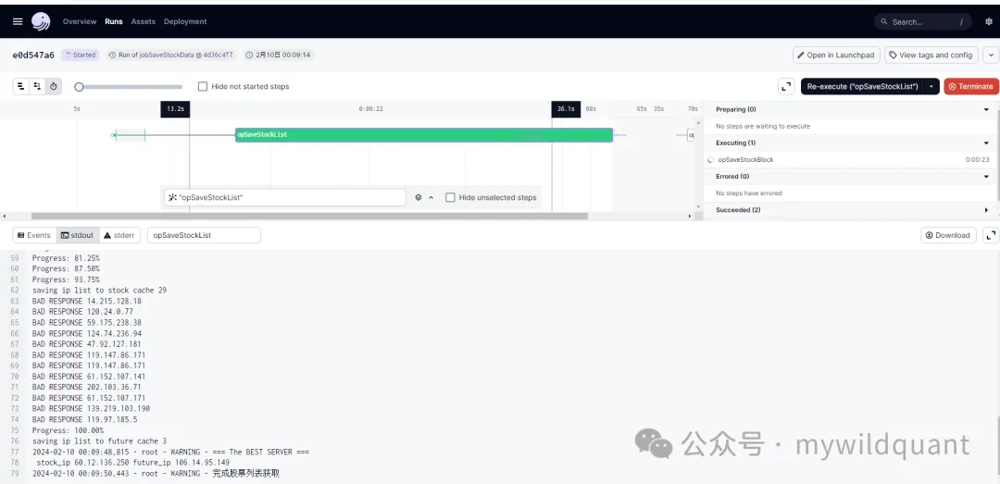

# 番茄量化Pro版

## FQ量化环境Docker安装部署指南

由于在Windows Docker Desktop上使用，因此一些命令遵循Windows的风格。

### Windows开启Linux子系统

首先确认CPU的虚拟化功能已开启。打开任务管理器，切换到性能的CPU选项卡，查看CPU虚拟化是否已开启。



如果未开启，请进入电脑的BIOS设置开启虚拟化。根据电脑主板的不同，请自行找到相应的配置选项进行修改。

分别开启电脑的虚拟化平台和Linux子系统服务，在Powershell中执行以下命令。

```
Enable-WindowsOptionalFeature -Online -FeatureName VirtualMachinePlatform -All -NoRestart
Enable-WindowsOptionalFeature -Online -FeatureName Microsoft-Windows-Subsystem-Linux -All -NoRestart
```

也可以使用以下dism命令在cmd中开启虚拟化和Linux子系统。

```
dism.exe /online /enable-feature /featurename:VirtualMachinePlatform /all /norestart
dism.exe /online /enable-feature /featurename:Microsoft-Windows-Subsystem-Linux /all /norestart
```

安装过程中如果需要重启电脑，请按照提示操作。

如果还没有安装WSL，用下面的命令安装WSL。

```
winget install Microsoft.WSL
```

或者是升级到WSL的最新版本。

```
winget upgrade Microsoft.WSL
```

更新WSL核心到最新版本（效果和winget upgrade Microsoft.WSL一样）。

```
wsl --update
```

查看确认WSL使用版本2。

```
wsl --status
```



如果默认版本不是2，请设置WSL的默认版本。

```
wsl --set-default 2
```

安装WSL的Ubuntu版本。

```
wsl --install -d Ubuntu
```

或者是用这个命令安装wsl的ubuntu（效果和wsl --install -d ubuntu一样）

```
winget install Canonical.Ubuntu
```

一般一个命令不顺畅的话，就试试另一个可替代命令。

### 安装Windows Docker Desktop

从Docker官网下载Docker Desktop并安装，建议基于WSL2进行安装。这种方式比之前的版本更稳定。安装完成后，系统托盘区会出现一个船形图标，双击即可打开Docker Desktop。

也可以用下面的命令来安装

```
winget install Docker.DockerDesktop
```



至此，Docker环境已经安装完成。

请记得配置镜像加速器，推荐使用阿里云的镜像加速器。需要注册并登录阿里云账号，在容器镜像服务中获取镜像加速器地址。务必配置加速器，否则镜像拉取速度会非常慢。

找到齿轮按钮打开设置。



在设置中添加镜像加速器地址，可以加速下载。

也可以使用其他加速地址，例如：

```
{
  "builder": {
    "gc": {
      "defaultKeepStorage": "20GB",
      "enabled": true
    }
  },
  "experimental": false,
  "registry-mirrors": [
    "https://dockerproxy.com",
    "https://mirror.baidubce.com",
    "https://docker.m.daocloud.io",
    "https://docker.nju.edu.cn",
    "https://docker.mirrors.sjtug.sjtu.edu.cn"
  ]
}
```

接下来开始安装量化系统。

### 设置环境变量

在环境变量中设置以下变量，系统运行时会用到它们。

- TDX_HOME：指向通达信的安装目录。
- FQ_PERSIST_DIR：指向量化系统数据存放目录（自己提前建好目录，保证目录存在）。

```
set TDX_HOME=E:\new_haitong
set FQ_PERSIST_DIR=E:\FQ_PERSIST_DIR
setx TDX_HOME E:\new_haitong
setx FQ_PERSIST_DIR E:\FQ_PERSIST_DIR
```

前两句是临时设置当前命令环境的变量，关闭窗口后设置会丢失。后两句是永久设置环境变量，下次打开时环境变量仍然存在。

### 执行部署

在源码的根目录运行脚本。

```
deploy.bat
```

提示选择通达信的目录。因为软件中需要读取通达信数据，这里输入通达信的安装目录。



如果环境变量已经设置正确，这里直接回车使用默认值即可。

提示选择数据存放目录。



同样，如果环境变量已经设置正确，直接回车使用默认值即可，同时确保目录存在。

提示是否需要构建rear镜像，第一次安装时选择Y，如果已经构建过且代码未更新，可以选择N。



等待rear镜像构建完成。如果遇到卡住的情况，一般是网络问题，建议使用代理。

另外有两个脚本build_rear.bat和build_web.bat，可以在运行deploy.bat前先运行这两个脚本构建镜像，这样运行deploy.bat时可以选择N。

询问是否需要构建web镜像，第一次或前端代码有更新时选择Y，否则选择N。



等待web镜像构建完成。

接下来脚本会在Docker中逐个部署容器。只需等待部署完成。

部署完成后，在浏览器中打开http://127.0.0.1:10003，这是自动化任务管理端。

切换到automation页面，打开自己要允许的任务。



这样每天会定时运行这些任务。

此时数据库中还没有数据。可以切换到Jobs页面，点击jobSaveStockData，点击Raunchpad，点击最右下角的Launch Run。这样就开始下载股票数据了。查看日志如图所示即为正常。



同样方法，运行jobSaveIndexData，jobSaveFutureData，jobSaveEtfData，jobSaveBondData，下载这几个历史数据。

至此，系统安装完成。在浏览器中打开http://127.0.0.1，可以访问系统的Dashboard。

## 自动任务说明

打开地址[http://127.0.0.1:10003](http://127.0.0.1:10003)，打开标签页Automation，在上面可以开启或者关闭自动任务。目前的任务有以下这些。

| 名称                                  | 说明                                      | 建议   |
| ----------------------------------- | --------------------------------------- | ---- |
| default_automation_condition_sensor | 默认的自动化sensor，要asset的自动物化就要打开这个开关。       | 务必打开 |
| job_clean_db_schedule               | 每天定时清理数据库中不需要永久保存的数据                    | 打开   |
| jobBackfillOrder_schedule           | 补单，例如昨天委托但未成交的订单，今天是否继续委托。如果开启，今天会继续委托。 | 按需打开 |
| jobReverseRepo_schedule             | 逆回购任务，每天收盘前把多余的资金进行逆回购，保留2W现金。          | 按需打开 |
| jobSaveBondData_schedule            | 收盘后下载债券的行情数据。                           | 打开   |
| jobSaveEtfData_schedule             | 收盘后下载ETF的行情数据。                          | 打开   |
| jobSaveFutureData_schedule          | 收盘后下载商品期货的行情数据。                         | 打开   |
| jobSaveStockData_schedule           | 收盘后下载股票行情数据                             | 打开   |
| jobUpdateStockPools_schedule        | 最初的股票池计算方式，已废弃                          | 不打开  |
| sensorSaveStockData                 | 股票行情数据下载完成探测，探测到股票数据下载完成就开始下载指数数据下载     | 打开   |
| sensorSaveIndexData                 | 指数数据下载完成探测，探测到指数数据下载完成就开始执行计算超级赛道       | 打开   |

## 参数配置说明

系统的配置信息放在freshquant数据库的params表中

miniqmt相关配置

```json
{
  "code": "xtquant",
  "value": {
    "path": "E:\\e海方舟-量化交易版\\userdata_mini",
    "account": "2******8"
  }
}
```

| key           | value                |
| ------------- | -------------------- |
| value.path    | qmt中userdata_mini的目录 |
| value.account | qmt的账号               |

通知配置

```json
{
  "code": "notification",
  "value": {
    "webhook": {
      "dingtalk": {
        "private": "https://oapi.dingtalk.com/robot/send?access_token=******",
        "public": "https://oapi.dingtalk.com/robot/send?access_token=******"
      }
    }
  }
}
```

| key                            | value         |
| ------------------------------ | ------------- |
| value.webhook.dingtalk.private | 持仓股有信号的钉钉通知   |
| value.webhook.dingtalk.public  | 候选股票池有信号的钉钉通知 |

gardian策略配置

```json
{
  "code": "gardian",
  "value": {
    "stock": {
      "positionPct": 40,
      "autoOpen": true,
      "lot_amount": 3000,
      "singleAmount": 3000,
    }
  }
}
```

| key                      | value                                      |
| ------------------------ | ------------------------------------------ |
| value.stock.positionPct  | 持仓比例阈值，如果仓位低于这个值，那么候选股出信号的时候会自动买入。         |
| value.stock.autoOpen     | true的时候，后选股出信号的时候才会自动买入，false的时候只买卖持仓股的信号。 |
| value.stock.lot_amount   | 一次买入的最大金额，实际买入会根据行情和持仓情况低于这个值。             |
| value.stock.singleAmount | 废弃，用lot_amount替换                           |

监控程序配置

```json
{
  "code": "monitor",
  "value": {
    "stock": {
      "periods": [
        "1m"
      ]
    }
  }
}
```

| key                 | value                   |
| ------------------- | ----------------------- |
| value.stock.periods | 要监控的时间周期，数组类型，可以配置多个周期。 |

系统Dashboard的url是：http://127.0.0.1

## 在Windows上安装FQ

上面我们讲的是在Docker中安装各种服务，在windows上我们也要把FQ给安装进去，那么有些事情我们是可以在Windows上完成的，比如后面要讲的命令行运维。

我们的安装需要依赖Miniconda3，所以我们要安装好Miniconda3。用如下命令可以直接安装。

```
winget install Anaconda.Miniconda3
```

然后我们要在Miniconda3的Prompt中，创建也给给FQ用的环境，比如我们创建也给fqkit的环境。用如下的命令。

```
conda create -n fqkit python=3.10
```

到这里后，你先确保你安装了Visual Studio Community 2022。如果没有的话，先安装好，我们的C++代码需要用到他来编译。记得同时安装好Visual Studio Community 2022的C++桌面开发组件。

安装完成后，我们就可以在源码的根目录运行install.bat来来安装FQ。

当然我们要先激活这个创建的环境。

```
conda activate fqkit
```

进入到你源码存放的根目录，比如：

```
cd E:\fqkit\freshquant
```

然后运行安装脚本：

```
install.bat
```

## 其他配置

### 关闭wsl crash dump

当crash的时候，为了以后不要生成dump文件导致磁盘撑爆，可以做如下的设置调整。

第一步：

建一个文件C:\Users\\<用户名>\.wslconfig，文件中放如下的内容

```
[wsl2]
kernelCommandLine = sysctl.kernel.core_pattern=/dev/null
```

第二步：

进入wsl的linux。

然后在wsl的linux中，用如下命令更改/proc/sys/kernel/core_pattern的内容。

```
echo '/dev/null' | sudo tee /proc/sys/kernel/core_pattern
```

第三步：

这步修改是为了保证重启后，配置还是有效。修改/etc/sysctl.conf的内容，

在文件末尾添加：

```
kernel.core_pattern=/dev/null
```

```

```
