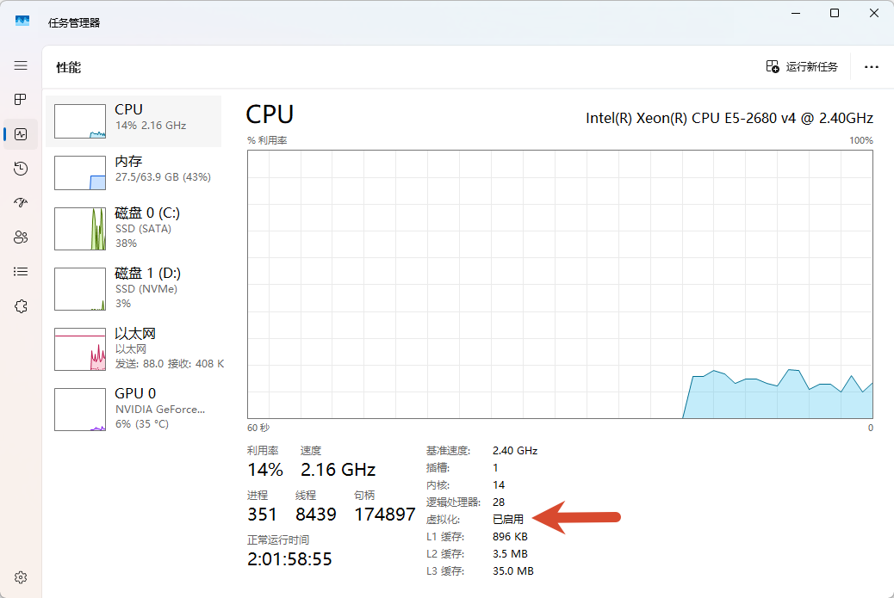
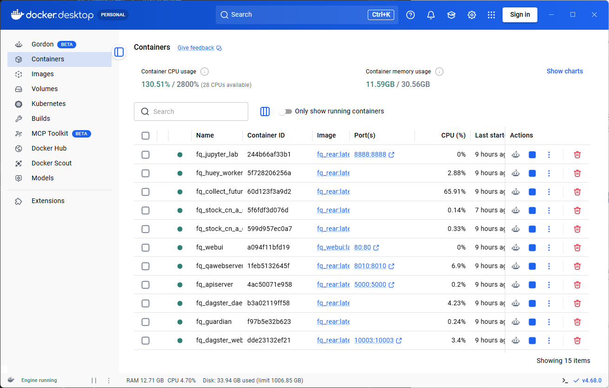
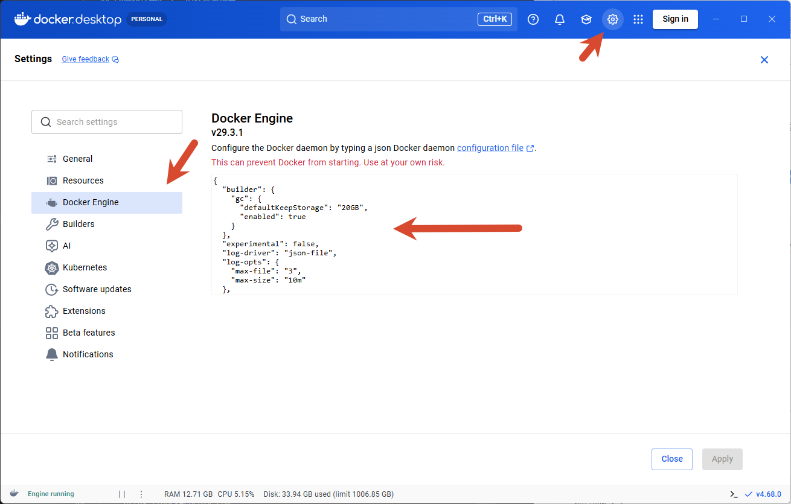
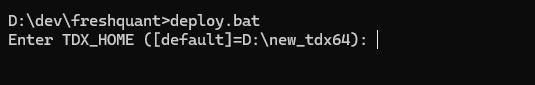
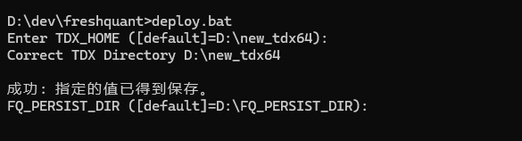
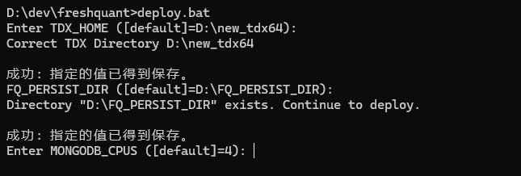
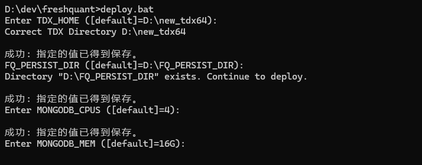
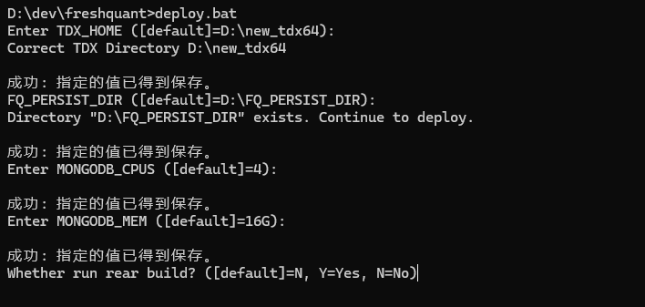
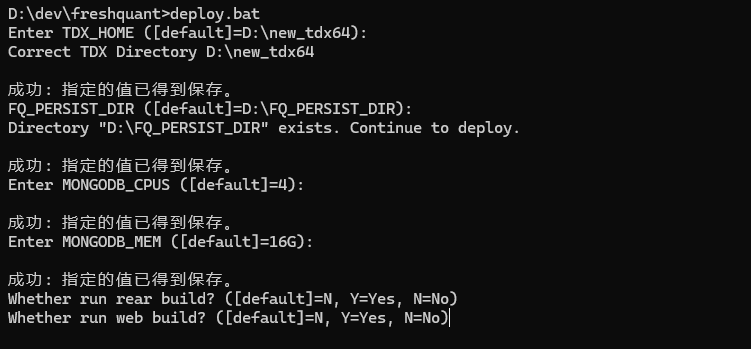
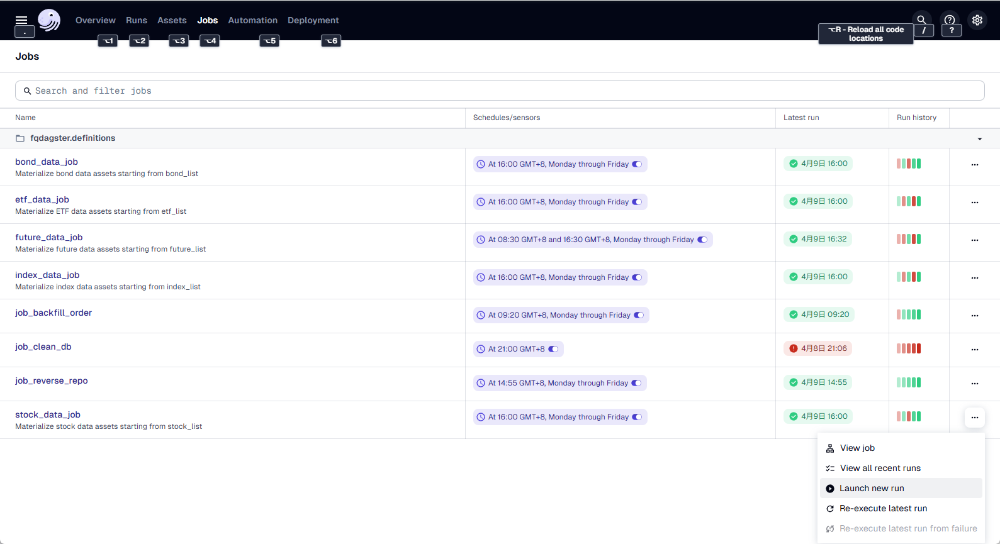

---
html:
  embed_local_images: true
  embed_svg: true
  offline: false

print_background: false
---

# 番茄量化专业版

## FQ量化环境Docker安装部署指南

由于在Windows Docker Desktop上使用，因此一些命令遵循Windows的风格。


### 系统环境准备步骤


### Windows的CPU虚拟化/虚拟机平台/WSL

首先确认CPU的虚拟化功能已开启。打开任务管理器，切换到性能的CPU选项卡，查看CPU虚拟化是否已开启。



如果未开启，请进入电脑的BIOS设置开启虚拟化。根据电脑主板的不同，请自行找到相应的配置选项进行修改。

分别开启电脑的虚拟化平台和Linux子系统服务，在Powershell中执行以下命令。

```
Enable-WindowsOptionalFeature -Online -FeatureName VirtualMachinePlatform -All -NoRestart
Enable-WindowsOptionalFeature -Online -FeatureName Microsoft-Windows-Subsystem-Linux -All -NoRestart
```

也可以使用以下dism命令在cmd中开启虚拟化和Linux子系统。

```
dism.exe /online /enable-feature /featurename:VirtualMachinePlatform /all /norestart
dism.exe /online /enable-feature /featurename:Microsoft-Windows-Subsystem-Linux /all /norestart
```

安装过程中如果需要重启电脑，请按照提示操作。

如果还没有安装WSL，用下面的命令安装WSL。

```
winget install --id Microsoft.WSL
```

或者是升级到WSL的最新版本。

```
winget upgrade --id Microsoft.WSL
```

更新WSL核心到最新版本（效果和winget upgrade --id Microsoft.WSL一样）。

```
wsl --update
```

### 安装 Windows Docker Desktop

从Docker官网下载Docker Desktop并安装，建议基于WSL2进行安装。这种方式比之前的版本更稳定。安装完成后，系统托盘区会出现一个船形图标，双击即可打开Docker Desktop。

也可以用下面的命令来安装。

```
winget install --id Docker.DockerDesktop
```



至此，Docker环境已经安装完成。

请记得配置镜像加速器，推荐使用阿里云的镜像加速器。需要注册并登录阿里云账号，在容器镜像服务中获取镜像加速器地址。务必配置加速器，否则镜像拉取速度会非常慢。

找到齿轮按钮打开设置。



在设置中添加镜像加速器地址，可以加速下载。

也可以使用其他加速地址，例如：

```
{
  "builder": {
    "gc": {
      "defaultKeepStorage": "20GB",
      "enabled": true
    }
  },
  "experimental": false,
  "log-driver": "json-file",
  "log-opts": {
    "max-file": "3",
    "max-size": "10m"
  },
  "registry-mirrors": [
    "https://dockerproxy.com",
    "https://mirror.baidubce.com",
    "https://docker.m.daocloud.io",
    "https://docker.nju.edu.cn",
    "https://docker.mirrors.sjtug.sjtu.edu.cn"
  ]
}
```

接下来开始安装量化系统。

### 安装UV

FQ 的安装使用 uv 作为 Python 环境和包管理工具。首先需要安装 uv，用如下命令可以直接安装。

```
winget install --id astral-sh.uv
```

同时确保已安装 Visual Studio Community 2026，并勾选了 C++ 桌面开发组件。FQ 的 C++ 代码需要用它来编译。

```
winget install --id Microsoft.VisualStudio.Community
```

安装时务必勾选 **C++ 桌面开发** 工作负载。

### 设置环境变量

在环境变量中设置以下变量，系统运行时会用到它们。

- FQ_HOME: FQ源码的根目录（根据你自己的填，比如我的是：D:\dev\freshquant）
- TDX_HOME：指向通达信的安装目录。
- FQ_PERSIST_DIR：指向量化系统数据存放目录（自己提前建好目录，保证目录存在）。

```
set FQ_HOME=D:\dev\freshquant
setx FQ_HOME D:\dev\freshquant

set TDX_HOME=D:\new_tdx64
setx TDX_HOME D:\new_tdx64

set FQ_PERSIST_DIR=D:\FQ_PERSIST_DIR
setx FQ_PERSIST_DIR D:\FQ_PERSIST_DIR
```

`set` 命令是临时设置当前命令环境的变量，关闭窗口后设置会丢失。`setx` 命令是永久设置环境变量，下次打开时环境变量仍然存在。

### 执行部署

在源码的根目录运行脚本。

```
deploy.bat
```

提示选择通达信的目录。因为软件中需要读取通达信数据，这里输入通达信的安装目录。



如果环境变量已经设置正确，这里直接回车使用默认值即可。

提示选择数据存放目录。



同样，如果环境变量已经设置正确，直接回车使用默认值即可，同时确保目录存在。

提示是否需要构建rear镜像，第一次安装时选择Y，如果已经构建过且代码未更新，可以选择N。

配置MONGODB的CPU数量。



根据你实际CPU核数，给他配置2个或者4个吧，

配置MONGODB的内存数。



如果你只有32G内存，就给MONGODB分配8G吧，如果你有64G内存，就给他分配16G吧。



等待rear镜像构建完成。如果遇到卡住的情况，一般是网络问题，建议使用代理。

另外有两个脚本build_rear.bat和build_web.bat，可以在运行deploy.bat前先运行这两个脚本构建镜像，这样运行deploy.bat时可以选择N。

询问是否需要构建web镜像，第一次或前端代码有更新时选择Y，否则选择N。



等待web镜像构建完成。

接下来脚本会在Docker中逐个部署容器。只需等待部署完成。

部署完成后，在浏览器中打开 http://127.0.0.1:10003 ，这是 Dagster 任务管理界面。

切换到 **Automation** 页面，可以看到所有自动化任务（Schedules）和传感器（Sensors）。Schedules 默认都是开启状态，每天会定时运行。


**重要**：需要手动开启 Asset 自动化传感器。在 Automation 页面找到 `default_automation_condition_sensor`，点击其前面的切换按钮将其开启。这个传感器是 Dagster Asset 架构的核心组件，负责监控和自动触发 Asset 的物化。

此时数据库中还没有数据。点击导航栏的 **Jobs**，进入 http://127.0.0.1:10003/jobs ，点击 `stock_data_job` 右边的三个点，选择 **Launch new run**，开始下载股票数据。



同样方法，依次运行 `index_data_job`、`etf_data_job`、`bond_data_job`、`future_data_job`，下载这几个历史数据。

**注意**：所有数据下载任务都基于 Asset 架构，依赖关系自动管理。首次下载时只需触发根 Asset 的 job（如 stock_data_job），系统会自动下载所有依赖数据。

至此，系统安装完成。在浏览器中打开http://127.0.0.1，可以访问系统的Dashboard。

## 代码更新与重新部署

当代码更新后，会以压缩包的方式提供。需要根据更新的内容选择合适的重新部署方式。

### 代码替换步骤

**重要**：不能直接解压覆盖，否则新版本中删除的文件会在旧版本中残留，可能导致系统运行异常。

**步骤：**

1. **删除旧的代码目录**

```bash
cd D:\dev
rmdir /S /Q freshquant
```

或在资源管理器中直接删除 `freshquant` 文件夹。

2. **解压新代码**

将新的压缩包解压到 `D:\dev\` 目录，确保生成 `D:\dev\freshquant` 目录。

**注意**：不要直接解压到现有的 freshquant 目录，必须先删除旧目录再解压。

3. **重新运行一次部署**

```bash
cd D:\dev\freshquant
deploy.bat
```

#### 常见问题

**Q: 为什么不能直接解压覆盖？**

A: 直接覆盖只会添加新文件和修改现有文件，但不会删除新版本中已经移除的文件。这些残留的旧文件可能导致系统运行异常、代码冲突、难以排查的错误。

### 更新场景分类

#### 1. 仅 Python 代码更新

如果只是修改了 Python 源代码（如策略、数据处理逻辑等），不需要重新构建 Docker 镜像。

**更新步骤：**

1. **替换代码**

按照上面的"代码替换步骤"保存配置文件、删除旧目录、解压新代码并恢复配置。

2. **重新部署容器**

```bash
deploy.bat
```

部署脚本会自动：
- 停止并删除所有 fq_ 开头的容器
- 使用现有的镜像重新创建和启动容器
- 保留所有数据卷（数据库、Redis、Dagster 等）

3. **更新 Windows FQ（必须执行）**

```bash
install.bat
```

**重要**：即使只是代码更新，也必须运行 install.bat 来同步 Windows 环境中的依赖和代码，否则命令行工具可能无法正常工作。

#### 2. 依赖更新或配置变更

如果修改了 `pyproject.toml`、添加了新的 Python 包依赖，或修改了 Dockerfile，需要重新构建 rear 镜像。

**更新步骤：**

1. **替换代码**

按照上面的"代码替换步骤"保存配置文件、删除旧目录、解压新代码并恢复配置。

2. **重新构建 rear 镜像**

```bash
build_rear.bat
```

等待镜像构建完成。如果遇到网络问题，建议使用代理。

3. **重新部署容器**

```bash
deploy.bat
```

在部署过程中，当提示 "Whether run rear build?" 时，选择 `N`（因为已经手动构建过）。

4. **更新 Windows FQ（必须执行）**

```bash
install.bat
```

**重要**：依赖更新后，Windows 环境必须同步安装新的依赖包，否则可能导致命令行工具运行失败。

#### 3. 前端代码更新

如果修改了前端代码（如 Web UI），需要重新构建 web 镜像。

**更新步骤：**

1. **替换代码**

按照上面的"代码替换步骤"保存配置文件、删除旧目录、解压新代码并恢复配置。

2. **重新构建 web 镜像**

```bash
build_web.bat
```

3. **重新部署容器**

```bash
deploy.bat
```

在部署过程中，当提示 "Whether run web build?" 时，选择 `N`。

4. **更新 Windows FQ（必须执行）**

```bash
install.bat
```

**重要**：即使只是前端更新，也建议运行 install.bat 以确保 Windows 环境与代码保持同步。

#### 4. 全量更新（代码 + 依赖 + 前端）

如果同时修改了多个部分，可以一次性重新构建所有镜像。

**更新步骤：**

1. **替换代码**

按照上面的"代码替换步骤"保存配置文件、删除旧目录、解压新代码并恢复配置。

2. **重新构建所有镜像**

```bash
build_rear.bat
build_web.bat
```

3. **重新部署容器**

```bash
deploy.bat
```

在部署过程中，两次构建提示都选择 `N`。

4. **更新 Windows FQ（必须执行）**

```bash
install.bat
```

**重要**：全量更新后，Windows 环境必须同步更新，包括新的依赖和代码变更。

### 验证更新

部署完成后，可以通过以下方式验证更新是否成功：

1. **检查容器状态**

```bash
docker ps
```

确保所有 fq_ 开头的容器都在运行。

2. **检查日志**

```bash
docker logs fq_dagster_daemon
docker logs fq_guardian
```

查看是否有错误信息。

3. **访问 Web 界面**

- Dagster UI: http://127.0.0.1:10003
- Dashboard: http://127.0.0.1

4. **测试功能**

在 Dagster UI 中手动触发一个简单的 job，确认系统正常运行。

### Windows 上的 FQ 更新

**重要**：每次代码更新后，除了更新 Docker 容器外，如果 Windows 上也安装了 FQ（用于命令行运维），必须同步更新。

1. **替换代码**

按照上面的"代码替换步骤"删除旧目录、解压新代码。

2. **运行安装脚本**

```bash
install.bat
```

install.bat 会自动完成以下操作：
- 检查并创建虚拟环境（如果不存在）
- 安装或更新 Python 依赖包
- 运行 install.py 完成安装

**注意**：不需要手动激活虚拟环境，install.bat 会自动处理。如果虚拟环境已存在，脚本会使用现有环境并更新依赖。

3. **验证安装**

```bash
.venv\Scripts\activate
fqctl --help
```

如果 fqctl 命令正常显示帮助信息，说明安装成功。

### 更新流程总结

完整的更新流程应该同时包含 Docker 容器更新和 Windows FQ 更新：

**仅代码更新：**
```bash
# 1. 按照"代码替换步骤"替换代码
# 2. 更新 Docker 容器
deploy.bat
# 3. 更新 Windows FQ（必须执行）
install.bat
```

**依赖或 Dockerfile 更新：**
```bash
# 1. 按照"代码替换步骤"替换代码
# 2. 重新构建镜像
build_rear.bat
# 3. 更新 Docker 容器
deploy.bat
# 4. 更新 Windows FQ（必须执行）
install.bat
```

**前端代码更新：**
```bash
# 1. 按照"代码替换步骤"替换代码
# 2. 重新构建 web 镜像
build_web.bat
# 3. 更新 Docker 容器
deploy.bat
# 4. 更新 Windows FQ（必须执行）
install.bat
```

### 常见问题

**Q: 更新后系统无法启动？**

A: 检查 Docker 镜像是否成功构建，查看容器日志排查问题：

```bash
docker logs <container_name>
```

**Q: 数据会丢失吗？**

A: 不会。所有数据都存储在数据卷中（`FQ_PERSIST_DIR`），更新容器不会影响数据。

**Q: 需要重启正在运行的任务吗？**

A: 部署脚本会自动停止和重启所有容器，包括正在运行的任务。建议在非交易时间进行更新。

**Q: 如何回滚到之前的版本？**

A: 保留旧版本的压缩包，需要回滚时按照"代码替换步骤"用旧版本压缩包替换当前代码，然后重新部署。

**建议**：每次更新前将当前版本的压缩包保存为 `freshquant_backup_YYYYMMDD.zip`。

## 自动任务说明

打开地址[http://127.0.0.1:10003](http://127.0.0.1:10003)，打开标签页Overview，可以查看所有定时任务的状态。

### 重要：开启 Asset 自动化传感器

系统使用 Dagster 的 Asset 架构，任务之间的依赖关系通过 Asset 依赖链自动管理。**首次部署后，必须手动开启 Asset 自动化传感器**：

1. 切换到 **Automation** 页面
2. 找到 `default_automation_condition_sensor`
3. 点击切换开关将其开启

这个传感器是 Dagster Asset 架构的核心组件，负责监控和自动触发 Asset 的物化。如果不开启这个传感器，Asset 的自动依赖链条将无法工作。

### 数据下载任务

| 名称                  | 说明                       | 执行时间              | 建议   |
| ------------------- | ------------------------ | ----------------- | ---- |
| stock_data_schedule  | 股票收盘作业保存行情数据（列表、日线、分钟、除权） | 工作日 16:00        | 打开   |
| future_data_schedule | 期货收盘数据保存（列表、日线、分钟）       | 工作日 08:30, 16:30 | 打开   |
| etf_data_schedule    | ETF收盘数据保存（列表、日线、分钟）       | 工作日 16:00        | 打开   |
| bond_data_schedule   | 债券收盘数据保存（列表、日线）           | 工作日 16:00        | 打开   |
| index_data_schedule  | 指数收盘数据保存（列表、日线、分钟）        | 工作日 16:00        | 打开   |

所有数据下载任务都基于 Asset 架构，执行时会自动下载依赖数据。例如股票数据任务会依次下载：股票列表 → 股票板块/日线/分钟/除权数据。

### 交易相关任务

| 名称                          | 说明                    | 执行时间          | 建议   |
| --------------------------- | --------------------- | ------------- | ---- |
| exec_reverse_repo_schedule  | 国债逆回购，每天收盘前把多余的资金进行逆回购 | 工作日 14:55    | 按需打开 |
| exec_backfill_order_schedule | 补单，昨天委托但未成交的订单继续委托    | 工作日 09:20    | 按需打开 |

### 系统维护任务

| 名称                | 说明            | 执行时间    | 建议   |
| ----------------- | ------------- | ------- | ---- |
| clean_db_schedule | 清理数据库中不需要永久保存的数据 | 每天 21:00 | 打开   |

### 任务执行说明

1. **首次下载数据**：系统安装完成后，需要在 Dagster UI 的 Jobs 页面手动触发首次数据下载。找到对应的 job（如 stock_data_job），点击 Launchpad，然后点击 Launch Run。

2. **Asset 依赖链**：系统采用 Asset 架构，任务之间的依赖关系自动管理。例如，下载股票日线数据会自动等待股票列表下载完成。

3. **任务监控**：在 Asset Catalog 页面可以查看所有 Asset 的状态和依赖关系。

## 参数配置说明

系统的配置信息放在 freshquant 数据库的 params 表中。可以通过运行 `fqctl init-param` 命令来交互式配置这些参数。

### xtquant 交易配置

```json
{
  "code": "xtquant",
  "value": {
    "path": "E:\\e海方舟-量化交易版\\userdata_mini",
    "account": "2******8"
  }
}
```

| key           | value                       |
| ------------- | -------------------------- |
| value.path    | MiniQMT 中 userdata_mini 的目录 |
| value.account | MiniQMT 的登录账号            |

### 通知配置

```json
{
  "code": "notification",
  "value": {
    "webhook": {
      "dingtalk": {
        "private": "https://oapi.dingtalk.com/robot/send?access_token=******",
        "public": "https://oapi.dingtalk.com/robot/send?access_token=******"
      }
    }
  }
}
```

| key                            | value                |
| ------------------------------ | ------------------- |
| value.webhook.dingtalk.private | 持仓股有信号的钉钉通知（私密通知） |
| value.webhook.dingtalk.public  | 候选股票池有信号的钉钉通知（公共通知） |

### guardian 交易守护者配置

```json
{
  "code": "guardian",
  "value": {
    "stock": {
      "position_pct": 30.0,
      "auto_open": true,
      "lot_amount": 3000.0,
      "min_amount": 1000.0
    }
  }
}
```

| key                    | value                                      |
| --------------------- | ------------------------------------------ |
| value.stock.position_pct | 最低仓位比例（%）。如果仓位低于这个值，候选股出信号时会自动买入。          |
| value.stock.auto_open    | 是否自动开仓。true 时候选股出信号会自动买入，false 时只交易持仓股的信号。 |
| value.stock.lot_amount   | 普通一网交易金额，实际买入会根据行情和持仓情况调整。                   |
| value.stock.min_amount    | 最低一网交易金额，用于小额资金场景。                          |

### monitor 监控程序配置

```json
{
  "code": "monitor",
  "value": {
    "stock": {
      "periods": ["1m"],
      "auto_open": true
    }
  }
}
```

| key                 | value                                    |
| ------------------- | ---------------------------------------- |
| value.stock.periods | 要监控的 K 线周期，数组类型，可选值：1m, 3m, 5m, 15m, 30m, 60m, 90m, 120m, 1d |
| value.stock.auto_open | 是否自动开启监控                             |

**注意**：
- guardian 配置中的 `position_pct`、`auto_open`、`lot_amount`、`min_amount` 字段名已更新为下划线命名
- monitor 配置中新增了 `auto_open` 字段
- 使用 `fqctl init-param` 命令可以安全地更新所有配置，无需手动编辑数据库

系统 Dashboard 的 URL 是：http://127.0.0.1

## 在Windows上安装FQ

上面我们讲的是在Docker中安装各种服务，在windows上我们也要把FQ给安装进去，那么有些事情我们是可以在Windows上完成的，比如后面要讲的命令行运维。

**重要**：在 Windows 上运行任何 FQ 命令（如 `fqctl`）之前，必须先完成本节安装，并激活虚拟环境：

```
.venv\Scripts\activate
```

我们可以在源码的根目录运行install.bat来安装FQ。

进入到你源码存放的根目录，比如：

```
cd D:\dev\freshquant
```

有两种安装方式：

**方式一：一键安装（推荐）**

直接运行安装脚本，会自动创建虚拟环境并安装FQ：

```
install.bat
```

安装脚本会自动完成以下步骤：
1. 检查 uv 是否已安装
2. 创建虚拟环境（Python 3.12）
3. 安装基础依赖（pip、chardet）
4. 运行 install.py 完成安装

**方式二：分步安装**

如果需要先创建虚拟环境再安装，可以使用 create_venv.bat 脚本：

```
create_venv.bat
```

这个脚本会创建一个可重定位的虚拟环境（Python 3.12），适合需要在多台机器间迁移环境的场景。

虚拟环境创建完成后，再运行：

```
install.bat
```

由于虚拟环境已经存在，install.bat 会跳过创建步骤，直接安装依赖和FQ。

**手动创建虚拟环境**

如果需要手动创建虚拟环境（不使用脚本），可以使用：

```
uv venv --python 3.12
```

或者创建可重定位的虚拟环境：

```
uv venv --relocatable --python 3.12
```

激活虚拟环境：

```
.venv\Scripts\activate
```

## 其他配置

### 关闭wsl crash dump

当crash的时候，为了以后不要生成dump文件导致磁盘撑爆，可以做如下的设置调整。

第一步：

建一个文件C:\Users\\<用户名>\.wslconfig，文件中放如下的内容

```
[wsl2]
kernelCommandLine = sysctl.kernel.core_pattern=/dev/null
```

第二步：

进入wsl的linux。

然后在wsl的linux中，用如下命令更改/proc/sys/kernel/core_pattern的内容。

```
echo '/dev/null' | sudo tee /proc/sys/kernel/core_pattern
```

第三步：

这步修改是为了保证重启后，配置还是有效。修改/etc/sysctl.conf的内容，

在文件末尾添加：

```
kernel.core_pattern=/dev/null
```
