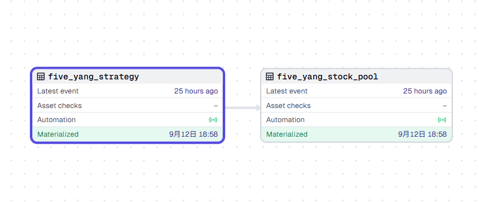
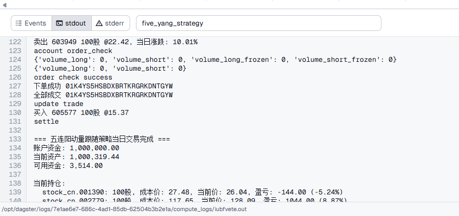

# Fq模拟盘选股系统和回测

在上一次的文章中，我谈到了要用Dagster来构建智能选股系统，这篇文章就是上一篇文章的延续，来说说如何用Dagster来构建模拟盘和回测系统。

上一篇文章中的示例代码只能称为是伪代码，是不能运行的，只是用来表达我的想法，所以这一篇文章，我会把上一篇文章中的伪代码变成可运行的代码。

在这之前，先重复说明我的观点。在Fq中所说的选股，并不是说选出来的股票让你直接梭哈的，Fq所说的选股只是用来发现市场的交易机会。

我们通过某一种策略来选出某一类股票，某一类股票聚合一起形成一个股票池，同时我们这个选股策略也会做为一个模拟盘来观测，我们需要关注每一个这样的选股策略在近期是否有赚钱效应，有赚钱效应的地方，就是我们要参与交易的地方。

可能和大家所说的策略和回测有所不同，所以有必要再来解释一下，以免误导读者。

可能有很多参与者，想通过回测来证明策略是不是有效。但是我的观点并不是这样的，我认为一个策略是不是有效，是和时间周期相关的，也就是说，不同的时间周期，同一个策略，它的表现是不一样的。

比如，一个策略在2015年表现很好，但是2016年表现很差，那么这个策略在2016年就不应该被采用，但是到了2017年这个策略又有效了。在从回测的角度来观察它，那么你觉得他是好策略和坏策略呢。市场上绝大多数策略都可能表现为这种情况。

所以在Fq中的目标是我们要衡量策略在本周本月他是否有赚钱效应，如果你有100个策略被观测，在近期有赚钱效应的策略，他们所形成的股票池，才是我们近期要参与交易的标的。

上面是一个总的指导思想，接下来我们就是要把他变成落地的系统。

## 今天用一个例子来阐述系统的设计

第一个，我们用五连阳的动量策略，先做一个MVP（最小可用产品），先让整个流程运行起来，以后只要按这个流程来开发更多的策略就可以了。



如图，five_yang_strategy是dagster的一个asset，我们把每个策略设计成一个asset。five_yang_stock_pool也是dagster的一个asset，他依赖five_yang_strategy，当five_yang_strategy产生数据的时候，five_yang_stock_pool会接收到数据，并生成关于这个策略的股票池。

five_yang_strategy的输入是全市场的股票，输出是五连阳的股票池。当然在以后开发的策略，他的输入也可以是其他策略生成的股票池，这样我们就实现了上一篇文章（https://mp.weixin.qq.com/s/5iHm-Cg8Va9JrDCLmHpCwQ）所说的，股票标的在策略之间的传递，构成一个流动的股票池链条。

所有作为模拟盘的策略assets被放在这个目录中：

```
freshquant/dagster/assets/sim/
```

比如：

```
freshquant/dagster/assets/sim/five_yang_strategy.py
```

```python
@dg.asset(
    description="五连阳动量策略",
)
def five_yang_strategy():
    # 具体逻辑省略
    pass
```

```python
@dg.asset(
    description="五连阳动量策略股票池",
    deps=["five_yang_strategy"],
)
def five_yang_stock_pool(five_yang_strategy):
    # 具体逻辑省略
    pass
```

然后我们用dagster的sensor来触发他们每天的自动更新。他们的定义在这里：

```
freshquant/dagster/sensors/five_yang_sensor.py
```

```python
@asset_sensor(
    asset_key=AssetKey("five_yang_strategy"),
    job=five_yang_stock_pool_job,
    name="five_yang_strategy_sensor",
    description="监控five_yang_strategy资产的更新，并触发five_yang_stock_pool的执行，生成五连阳的股票池",
)
def five_yang_strategy_sensor(context, event):
    """
    监控five_yang_strategy资产的更新，并触发five_yang_stock_pool的执行

    当five_yang_strategy资产更新时，立即触发five_yang_stock_pool的执行，
    确保股票池数据始终与策略结果保持同步。
    """
    # 当five_yang_strategy资产更新时，触发five_yang_stock_pool的执行
    return RunRequest(run_key=None)
```

以上我们就完成了一个策略模拟盘的开发，他会在每天盘后数据下载完成后，自动执行。

每个策略的运行就是模拟盘，我们可以在dagster的面板中参考他们的执行日志。



现在只是MVP，信息暂时比较简单，以后需要把输出信息做的更丰富一些。

另外我们在模拟策略的设计上，把公共的部分抽取做成一个基类BaseStrategy。

```
freshquant/sim/base_strategy/main.py
```

```python
class BaseStrategy(ABC):
    """
    交易策略基类

    提供通用的账户管理、订单执行、技术指标计算等功能，
    可作为各种具体策略的父类，实现代码复用。
    """
    pass
```

```
freshquant/sim/five_yang_strategy/main.py
```

那么具体的实现类，只要实现should_buy和should_sell方法即可，就可以完成一个策略的开发。

```python
class FiveYangStrategy(BaseStrategy):
    def __init__(self, init_cash=1000000, lot_size=3000, nodatabase=True):
        pass

    def should_buy(self, hist_data, current_idx):
        # 返回True表示买入，False表示不买
        return True

    def should_sell(self, pos: QA_Position, hist_data: pd.DataFrame, current_idx):
        # 返回True表示卖出，False表示不卖
        return True
```

## 回测系统

虽然我觉得回测不能作为策略是否有效的判断标准，但是回测还是很有必要的，因为回测可以让我们看到策略在历史上的表现。

我们的回测不需要一定依赖某个框架，当前我选择了使用backtrader来做回测。

前面的模拟盘我们是基于QA的QIFIAccount来做的，以后我们可以以QIFIAccount为基础来评估模拟盘的表现。

但是这样的策略不能直接在backtrader中使用，为了让backtrader中也能回测基于QIFIAccount的策略，我们采用了一个适配器模式，也就是开发一个通用的适配器，此适配器可以适配我们的模拟盘策略，让他能在backtrader中使用。

```
freshquant/backtest/backtrader/base/backtrader_adapter.py
```

```python
class BacktraderStrategyAdapter(bt.Strategy):
    """
    BaseStrategy到Backtrader的通用适配器类

    这个适配器类继承自backtrader.Strategy，可以适配任何BaseStrategy的子类，
    将backtrader的回测框架与BaseStrategy的交易逻辑连接起来。
    """
    pass
```

同时我们再实现一个BackTraderRunner类，来负责回测的运行。

```
freshquant/backtest/backtrader/base/backtrader_runner.py
```

这样所有的策略只要简化成这样就能直接在backtrader中运行回测，只要按这个模式来写策略，就可以很方便地和backtrader集成。

```python
class FiveYangStrategyTester(BacktraderTester):

    def __init__(self):
        self.strategy_class = FiveYangStrategy


if __name__ == "__main__":
    run_tester(FiveYangStrategyTester())
```

如果以后要用其他的回测框架，那么我们也可以用这种模式来开发一个其他框架的适配器，这样就可以很方便地切换回测框架了。

如下所示，我们运行这个脚本来回测这个为MVP做的模拟策略。

```
python freshquant/backtest/backtrader/five_yang_strategy/main.py
```

这次更新的意义在于，我们完成了策略的模拟盘和回测系统，以后只要按照这个模式来开发策略，就可以很方便地实现策略的模拟盘和回测了。


**再强调一次，这次更新也只是一个MVP，以后会继续完善，包括回测系统，以及策略的可视化等。**